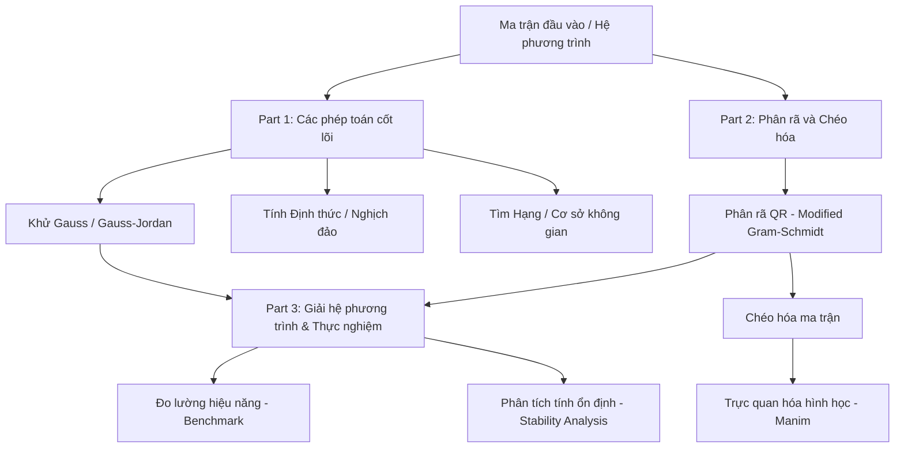

# Đồ án: Ma trận và Tính toán Khoa học - Toán Ứng dụng & Thống kê

## 👥 Danh sách thành viên nhóm 1

* **24120239 - Phí Công Tuấn (Nhóm Trưởng)** 
* **24120260 - Trương Tuấn Anh**
* **24120295 - Phạm Xuân Duy**
* **24120301 - Lâm Đông Hải**
* **24120315 - Phạm Huy Hoàng**

---

## 📘 Tổng quan đồ án

Đồ án này tập trung vào ba nhóm kỹ thuật cốt lõi của đại số tuyến tính số trên máy tính:

1. **Phép khử Gauss**: Xây dựng nền tảng cho việc giải hệ phương trình tuyến tính, tính định thức, tìm ma trận nghịch đảo và xác định hạng ma trận.
2. **Phân rã ma trận và Chéo hóa**: Đi sâu vào bản chất hình học của không gian vector, kết hợp ứng dụng thư viện Manim để trực quan hóa sinh động quá trình biến đổi.
3. **Ổn định số học và chi phí tính toán**: Đánh giá thực nghiệm hiệu năng và mức độ sai số của các phương pháp số (như Gauss-Seidel, phương pháp lặp) trong thực tế.

Mục tiêu của dự án không chỉ dừng ở lý thuyết mà còn đòi hỏi khả năng cài đặt thuật toán hoàn toàn từ đầu bằng Python thuần, xây dựng video hoạt hình toán học chuyên nghiệp, và tiến hành benchmark độ chính xác cũng như hiệu suất hệ thống một cách bài bản.

### Luồng xử lý hệ thống



---

## 📂 Cấu trúc thư mục

```text
Group_01
|---part1 (Phép khử Gauss và các ứng dụng)
|     |---determinant.py       # Tính định thức ma trận
|     |---gaussian.py          # Thuật toán khử Gauss & Gauss-Jordan
|     |---inverse.py           # Tìm ma trận nghịch đảo
|     |---rank_basis.py        # Tìm hạng và cơ sở không gian
|     |---part1_demo.ipynb     # Trình diễn thuật toán phần 1
|---part2 (Phân rã ma trận và Trực quan hóa với Manim)
|     |---decomposition.py     # Phân rã QR (MGS)
|     |---diagonalization.py   # Thuật toán lặp QR chéo hóa
|     |---manim_scene.py       # Kịch bản animation Manim
|     |---demo_video.txt       # Video demo phân rã QR và chéo hóa 1080p60
|---part3 (Giải hệ phương trình và Phân tích hiệu năng)
|     |---solvers.py           # Các bộ giải Ax = b (Gauss, QR, Gauss-Seidel)
|     |---benchmark.py         # Script đo lường thời gian thực thi
|     |---analysis.ipynb       # Phân tích sai số và độ ổn định số học
|---report (Báo cáo chi tiết)
|     |---main.pdf             # Tệp PDF báo cáo chính thức
|---requirements.txt           # Danh mục thư viện và phiên bản
|---README.md                  # Tài liệu hướng dẫn dự án
```

## ⚙️ Hướng dẫn cài đặt môi trường

Để vận hành mã nguồn, yêu cầu hệ thống đã cài đặt Python phiên bản 3.12 hoặc mới hơn. Quy trình cài đặt các thư viện bổ trợ được thực hiện qua lệnh sau:

```bash
pip install -r requirements.txt
```

## 💻 Hướng dẫn sử dụng 

Đồ án được chia thành 3 phần chính, mỗi phần tương ứng với một phương thức thực thi riêng biệt:

### Phần 1: Trình diễn các thuật toán cơ bản
Mở tệp Jupyter Notebook để xem chi tiết từng bước thực thi thuật toán Khử Gauss, Định thức, Nghịch đảo, Hạng và Cơ sở:
```bash
jupyter notebook part1/part1_demo.ipynb
```

### Phần 2: Trực quan hóa hình học không gian (Manim)
Kịch bản `manim_scene.py` chứa các hoạt ảnh mô phỏng quá trình phân rã QR và chéo hóa. Render video bằng lệnh sau (đảm bảo môi trường đã cài đặt Manim):
```bash
manim -pql part2/manim_scene.py QRAndDiagonalization
```
*(Ghi chú: Thay cờ `-pql` bằng `-pqh` để render video ở chất lượng cao 1080p60)*

### Phần 3: Phân tích và Đánh giá hiệu năng
1. **Chạy kịch bản đo lường thời gian thực thi:**
   Mở terminal và chạy tệp script bằng Python:
   ```bash
   python part3/benchmark.py
   ```
2. **Xem phân tích chi tiết về sai số và độ ổn định số học:**
   Mở tệp Notebook phân tích để xem các biểu đồ Log-Log và đánh giá:
   ```bash
   jupyter notebook part3/analysis.ipynb
   ```